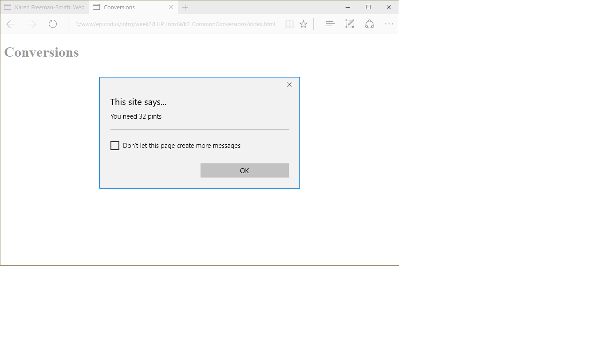

# BMI & Unit Conversions
Version 0.0.1: March 28, 2016
by [Karen Freeman-Smith](https://karenfreemansmith.github.io)

### Technologies Used
HTML, CSS, Bootstrap, JavaScript, jQuery

## Description
*[Learn How To Program](http://learnhowtoprogram.com) Intro to Programming Week 2 Individual Project: Create website to make conversions to practice jQuery functions.*

* Give height & get a list of thumbnails for rides that someone your height can ride.
* Click on thumbnails and see a larger image/park location information on modal form.

## Setup/Installation
* [View on Github Pages](https://karenfreemansmith.github.io/LHP-IntroWk2-CommonConversions)
* _OR_
* Clone directory
* Open index.html in your favorite browser

## Support & Contact
For questions, concerns, or suggestions please email karenfreemansmith@gmail.com

## Known Issues
* None

## Legal
*Licensed under the GNU General Public License v3.0*

Copyright (c) 2016 Copyright _[Karen Freeman-Smith](https://karenfreemansmith.github.io)_ All Rights Reserved.
